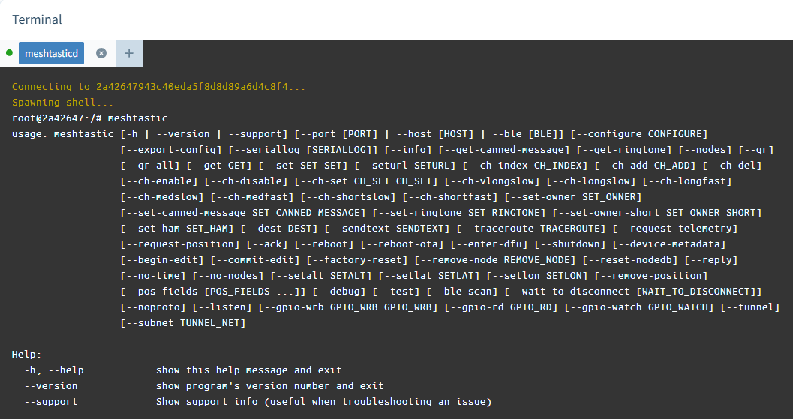

# 🚧 UNDER CONSTRUCTION 🚧

# <kbd></kbd> <kbd></kbd> balena-pymc-repeater

This project provides a containerized environment for running and managing `pymc_repeater` on balena-enabled hardware.

## The goal for this project is to be able to stand up a `pymc_repeater` container and completely manage it via balenaCloud with minimal hand-editing of config files and no container-level code changes.

Specifically, no arcane docker/linux knowledge is required (though some linux awareness sometimes helps for advanced changes). But it's close to turnkey. 

## Key Features:
* **Simplified Management:** Utilizes environment variables to configure behavior and application settings for the corner cases where you don't want to use the pymc web gui. 
* **Automatic Deployments:** Release and dev branches, will automatically update unless you pin to a specific release
* **Persistent Configuration:** Configuration file structures are persistent and read/write, ensuring settings survive updates.
* **Template-Based Setup:** If an existing `config.yaml` is not found, one is automatically created from `config.yaml.example`.
* **Maintenance & Debug Mode:** Includes support for debugging and terminal access to the container for manual adjustments when needed.
* **2 stage docker build:** Builds the code, then deploys to a minimal docker image. Run image is only ~256MB!
* **Can be manually edited via Balena terminal** Nano, vi, etc are available to edit config files in the balena terminal

## Current Status:
* **v0.5 Alpha** Runs successfully. Only manual config via web or config.yaml

* **dev branch** adding key variable support, refining run script

# Usage:

## 1. Create a free tier account at [balena-cloud.com](https://dashboard.balena-cloud.com/login)

## 2. Deploy by clicking the URL/Button below:

### OR for bleeding edge dev balena branch (unstable):

## 3. Once logged into balena, it will create a fleet for *balena-pymc-repeater*
## 4. Create your device and download the disk image
* Select your device type (e.g., Raspberry Pi 3, 4 or similar).
* Download the image and flash it to a microSD or eMMC using Balena Etcher or similar tools.

## 5. Power up your device
* The environment will download and start up automatically.
* Once running, you can access the container terminal via the balenaCloud dashboard to run commands or inspect logs.
* You'll want to note the local IP address on the dashboard if you do not know it already

## 6. Access the PYMC_repeater web control plane GUI
* Using your browser navigate to: **http://your_IP_addr:8000
* The PYMC web gui should load and start the setup dialog. Work through this, selecting radio, region, etc. Note the current build dropped the Nebrahat, which I will readd. 
* When it's complete, PYMC will restart the container. There is a sleep delay when PYMC exits which will need to expire, or you can hit the recycle button on the balena dashboard to restart the container. 
* It'll come up running the gui, and you should start seeing packets if all is set correctly
* If you need to adjust the config, use the terminal, select the pymc container, and it will give you a shell prompt. All editable files should be accessible as the _repeater_ user, but sudo is available if needed. 

# Controlling Behavior with Env Variables:
### (Under Construction)
Set these via the balenaCloud dashboard for your fleet or specific device to configure or manage:

***Working***
* none yet! :-)

***Planned***
* **DEBUG:** Set to `1` to enable a default 300-second sleep (useful for terminal access/debugging).
* **SLEEP:** Set to desired sleep period (useful for terminal access/debugging). Overrides defaul 60 second sleep.
* **RESET:** Set to `1` to restore to a default config.yaml, will trigger setup menu. Does not overwrite databases
* **CLEAN:** Set to `1` to restore wipe all config / data and start fresh
* **KEY:** Set to desired key from existing config, sets as key in config.yaml
* **OWNER:** Set to desired owner string, stores in config.yaml
* **NODENAME:** Set to desired name string, stores in config.yaml
* **REGION:** Set to desired region radio preset, stores in config.yaml
* **PASSWORD:** Set to desired admin panel password, stores in config.yaml

**Notes:**
* setting the password will prevent the setup dialog from running! You'll need to setup everything manually like radio, region, etc. 
Balena Device or Fleet environment variables can be used to set configuration and change behavior:

* Any which impact config.yaml are executed prior to startup of _pymc_repeater_

# Configuration:
The application expects a `config.yaml` file. The container is designed to check for this file on boot; if missing, it will seed the directory with a template. 

# Persistant Volumes:
**read / write:**
* **/etc/pymc_repeater** mainly contains config,yaml, but can hold backup configs, etc
* **/var/lib/pymc_repeater** main runtime data dir for databases, also home dir for the **repeater** user. By default the identity key is stored in a hidden folder here unless overridden in _config.yaml_

**read only:**
* **/opt/lib/pymc_repeater** has normal default files from build
* **/usr/local/bin** has support scripts, including the normal script to import a private key of your chosing. 
* **/usr/local** normal python pip install locations for libs and executables (lib and bin respectively)

# Balena Terminal: 
 Use the balena terminal to hand edit or manipulate the running environment.

# Release versions
Any updates for *balena-pymc-repeater* will be automatically deployed to your devices. If an update creates issues, you can pin to a prior release using the balena releases page.

# Credit:
*  [LLoyd pymc-dev](https://github.com/pymc-dev) The excellent pymc_repeater project itself is why we are here. [https://github.com/pymc-dev/pyMC_Repeater](https://github.com/pymc-dev/pyMC_Repeater)
*  [Michael Gillet's](https://github.com/migillett) (migillett) docker contribution to the pymc_repeater code [https://github.com/migillett/pyMC_Repeater](https://github.com/migillett/pyMC_Repeater) informed inital prototype of this balena based project. There are still tidbits leveraged in the build. 

---
*Maintained by [pinztrek](https://github.com/pinztrek/balena-pymc-repeater)*
